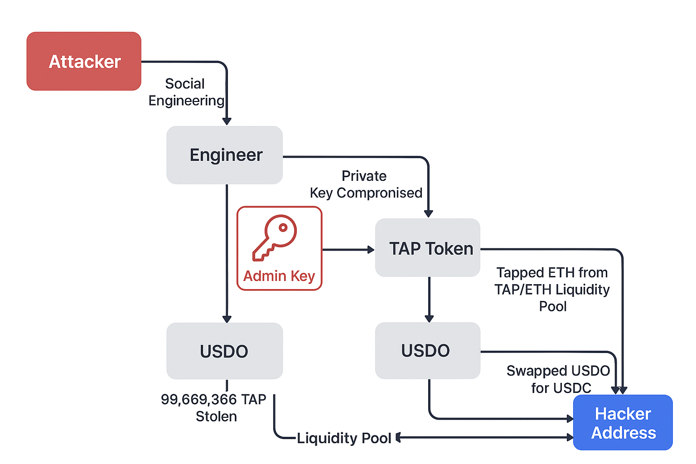

# 🛡️ Tapioca DAO Security Breach – A Deep Dive

On 18 October, Tapioca DAO suffered a devastating social engineering attack targeting a core smart contract engineer. The incident resulted in a total theft of approximately 605 ETH and 3.1M USDC (~$4.65M USD).  

The attack highlights fundamental issues in DeFi operational security, contract admin practices, and personnel trust assumptions.

---

## 📌 Incident Summary

The attacker(s) employed a “contagious interview” tactic, where:

1. A fake recruiter or job seeker posed as a legitimate contact via LinkedIn.  
2. The engineer was instructed to download a malicious `.env` file, injecting malware that provided full control of private keys.  
3. Exploited private keys enabled direct access to admin roles on token contracts and liquidity pools.

---

## 🔐 Exploit Flow

### 1. TAP Token Theft

- Admin ownership of TAP token vesting contracts was transferred to the attacker.  
- 29,669,866 TAP tokens (~$38M at the time) were stolen via the vesting contract's “rescue” function.  
- Tokens were liquidated on Uniswap, draining ETH from the TAP/ETH liquidity pool (~$1.6M USD).

### 2. USDO/USDC Liquidity Exploit

- The attacker added a new minter to the USDO stablecoin contract.  
- Minted 315.5 trillion USDO tokens to drain the USDO/USDC liquidity pool (~3.1M USDC).  
- Exploit occurred due to single-signer admin control on hot wallets, despite previous DAO directives to migrate to a 4-of-7 multisig.

### 3. Core Vulnerabilities

- **Single Admin Key:** Concentrated control allowed full exploitation of both TAP and USDO contracts.  
- **Ignored Security Devices:** Engineer did not use cold storage, hardware 2FA, or other provided security measures.  
- **Task Compliance Gaps:** Repeated ClickUp tasks to transfer admin roles were falsely marked as completed.  
- **Personnel Vulnerabilities:** Engineer actively sought employment following internal restructuring, increasing susceptibility to the social engineering attack.

---

## 🕵️ Detailed Timeline

| Time (UTC) | Action |
|------------|--------|
| 10:09:07 | Ownership of Tapioca Multicall contract transferred to attacker |
| 10:09:27 | New minter added to USDO contract |
| 10:09:49 | USDO minted by attacker |
| 10:11:00 | USDO swapped for USDC, draining liquidity pool |
| 10:56:05 | TAP vesting contract ownership transferred |
| 10:56:37 | Emergency “rescue” function called on TAP vesting contract |
| 11:00:45 | Stolen TAP & USDO tokens swapped on Uniswap |
| 11:04:19 | Funds moved to Binance Smart Chain (via Stargate) |
| 11:18:00 | Breach reported, SEAL911 engaged, war room established |
| 11:22:00 | Root cause identified: attacker controlled admin keys |

> All stolen funds were tracked, and ~996 ETH ($2.65M) was recovered via emergency exploit before laundering.

---

## 🛠️ Root Cause Analysis

1. **Operational Security Failures**

   - Admin roles were concentrated in a single hot wallet.  
   - Engineer ignored provided security tools and cold storage directives.  
   - DAO relied heavily on task completion markers instead of enforced compliance.

2. **Social Engineering Vulnerability**

   - Attacker leveraged professional trust and recruitment process.  
   - “Contagious interview” tactics exploited human factors rather than technical vulnerabilities.

3. **Governance Gaps**

   - Lack of multi-party review for critical contract admin actions.  
   - Absence of real-time monitoring for high-risk contract operations.  
   - Insufficient separation between development and protocol control roles.

---

## 🛡️ Post-Mortem Security Measures

### Web3 Protocol Improvements

I feel like this response was very appropriate given the circumstances. I mean the fact that the war room was set up within minutes is a testament to the team. If I had to suggest improvements (aside from the obvious single hot wallet containing a lot of money / multi-sigs), it would be:
- **Real-Time Observability:** Transparent monitoring of all smart contract balances and ownership.  
- **Anomaly Detection:** Automatic pausing on suspicious activity.

---

## 📚 References

- [Tapioca DAO Post-Mortem](https://mirror.xyz/tapiocada0.eth/RVcRuKmJAavD05ObYsyYOHLDJ4gkEZKwyY_Y0Gx6gNc)  
- [Stolen Funds on Twitter Announcement](https://x.com/Stablecoin/status/1848390039975469094)  
- [Arbitrum Blockchain Explorer](https://arbiscan.io)  
